# 🌾 Seasonal Agriculture Performance Analysis

**Final Project — VOIS for Tech (Vodafone Idea Foundation) x Edunet Foundation**
**Data Analytics Virtual Internship Program**

---

## 📌 About the Project

This project analyzes agricultural performance across different seasons, regions, and farming conditions using a dataset of **4,000 farm records** spanning multiple states, crops, and irrigation methods. The goal was to explore how seasonal variations affect agricultural outcomes and to derive evidence-based insights and recommendations for better agricultural planning.

## 🎯 Objective

To analyze seasonal agricultural data and identify meaningful patterns, trends, relationships, and differences in agricultural performance — covering data cleaning, exploratory data analysis (EDA), statistical analysis, and independent student-designed investigations.

## 🛠️ Tools & Libraries Used

- **Python** (Google Colab)
- **Pandas** — data loading, cleaning, and aggregation
- **Matplotlib** & **Seaborn** — data visualization

## 📂 Dataset Overview

- 4,000 farm records
- 27 columns covering: location (State/District), Crop, Season, environmental factors (Rainfall, Temperature, Humidity, Sunlight), soil health (pH, Moisture, N-P-K levels), farming inputs (Fertilizer, Pesticide, Irrigation Method, Seed Quality), and outcomes (Yield, Production, Cost, Revenue, Profit, Water Usage)

---

## 🔍 Analysis Workflow

### 1. Data Cleaning & Preparation
- Loaded dataset, examined shape, structure, and data types
- Found and handled missing values (~1% each) in `Rainfall_mm`, `Soil_Moisture_pct`, and `Yield_Tonnes_Ha` using median imputation
- Verified no duplicate records

### 2. Descriptive Statistics & Outlier Detection
Used `.describe()` and the IQR method to investigate outliers in Yield, Production, Profit, and Water Usage.

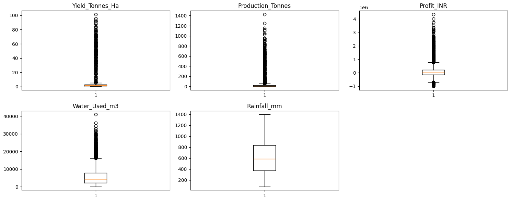

**Finding:** 6–10% of records were high-side outliers across these columns — consistently one-directional, indicating genuine high-performing farms rather than data errors. These were retained for analysis.

### 3. Univariate Analysis
Explored individual variable distributions.

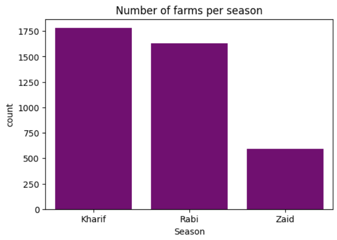
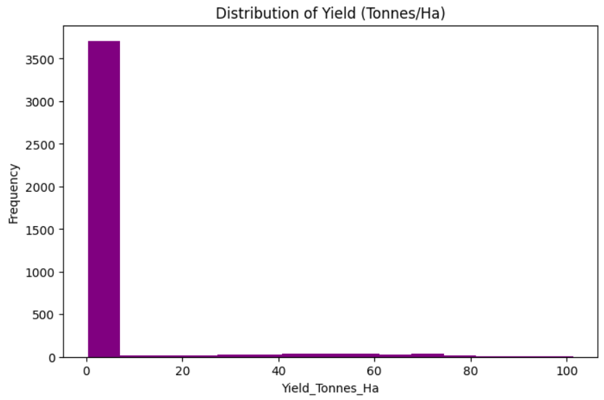
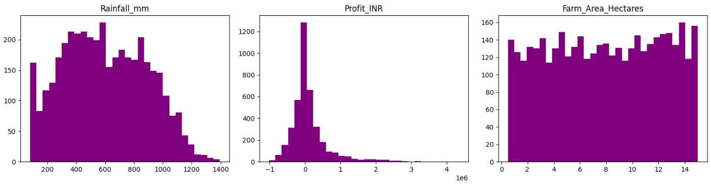
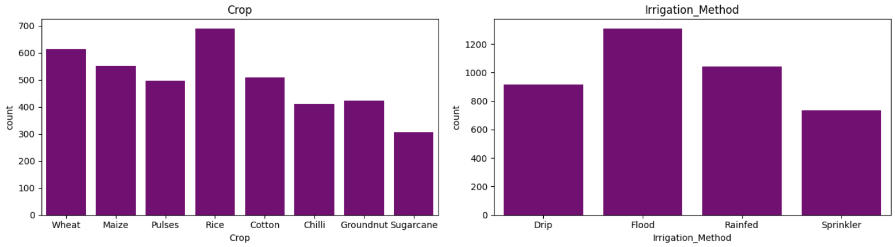

**Finding:** Kharif is the most represented season; Zaid is notably underrepresented. Rainfall and Farm Area are fairly evenly distributed, while Profit and Yield are heavily right-skewed.

### 4. Bivariate Analysis
Explored relationships between pairs of variables.

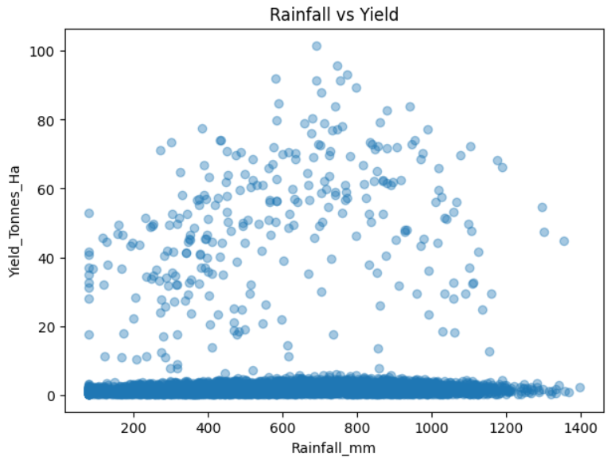
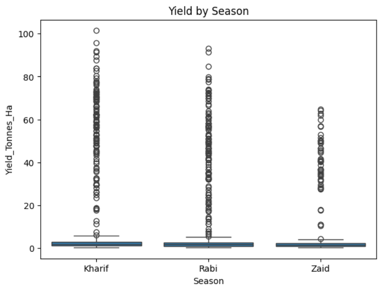
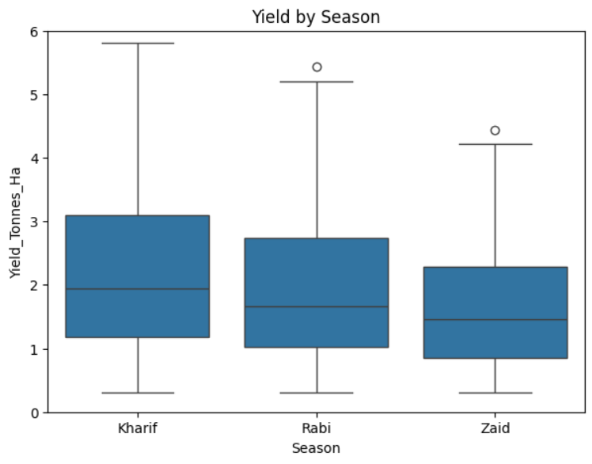
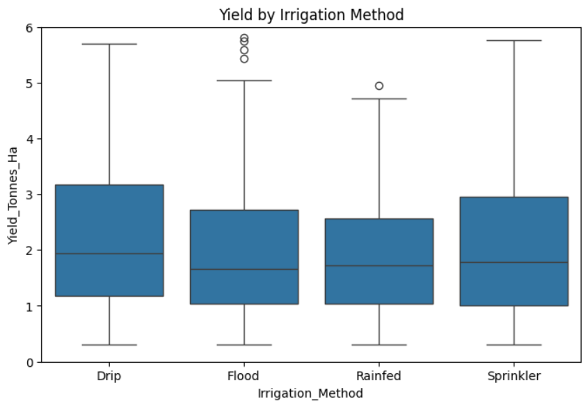

**Finding:** High-yield farms cluster around 600–700mm rainfall. Kharif season shows the highest and most consistent yield. Drip and Sprinkler irrigation outperform Flood and Rainfed methods.

### 5. Multivariate & Correlation Analysis

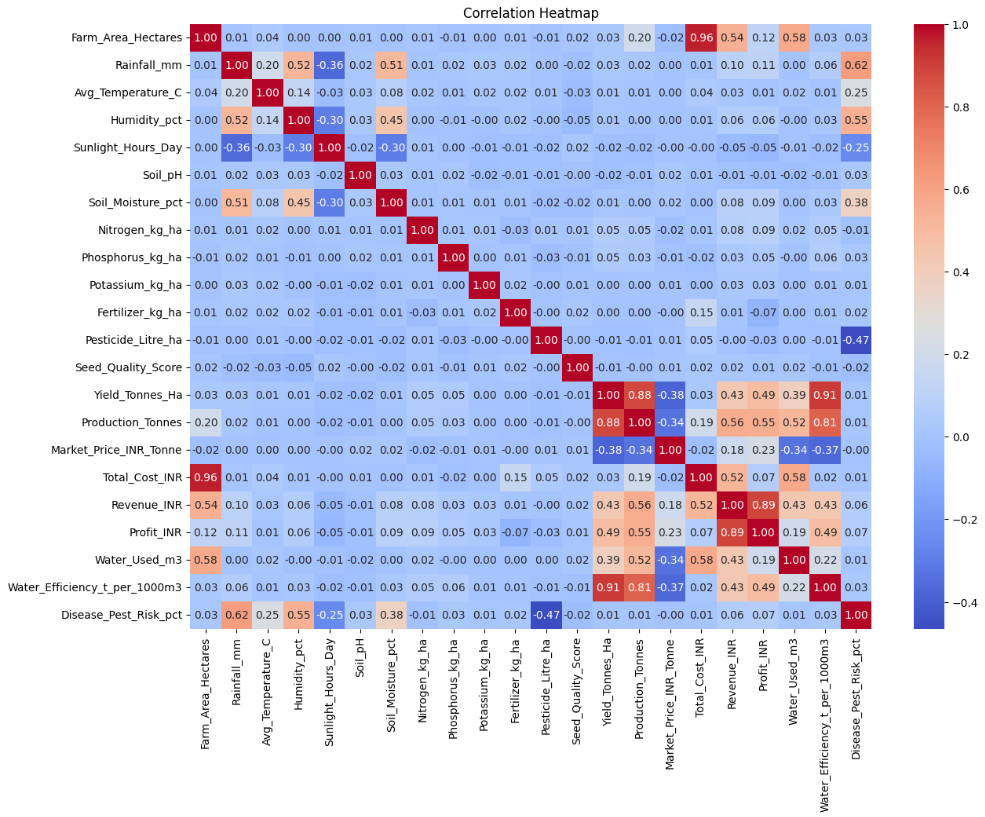

**Finding:** Farm Area strongly drives Total Cost (0.96). Yield correlates strongly with Water Efficiency (0.91) and Production (0.88). Interestingly, individual inputs (Fertilizer, Pesticide, N-P-K, Seed Quality) show almost no linear correlation with Yield.

### 6. Seasonal Comparison

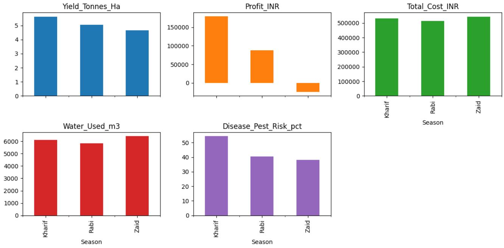

**Finding:** Zaid season operates at an average **loss** (-₹24,804) despite the highest cost and water usage — the least resource-efficient season. Kharif is the most profitable overall.

### 7. Student-Designed Analyses

**Q1: Which states are most profitable — and is any state operating at a loss?**
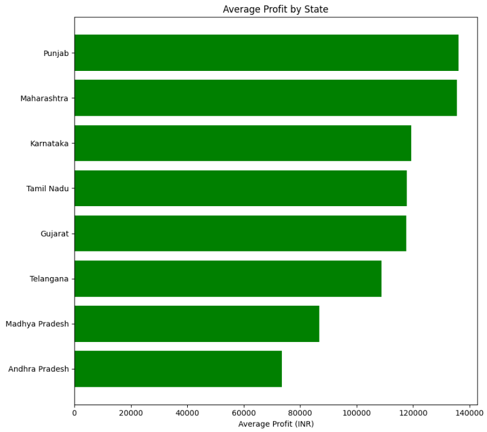
Punjab, Maharashtra, and Karnataka lead in profitability. No state shows a net loss, confirming the Zaid season loss is season-specific, not regional.

**Q2: Which crop is the most water-efficient?**
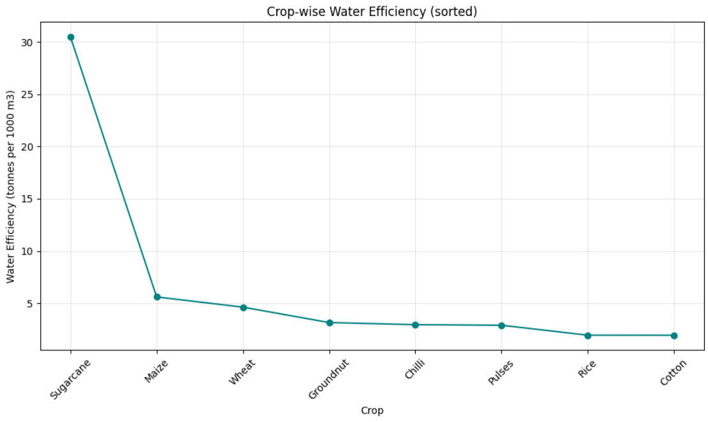
Sugarcane is dramatically more water-efficient (~30 t/1000m³) than all other crops (2–6 t/1000m³ range).

**Q3: Does higher disease/pest risk always lower profit?**
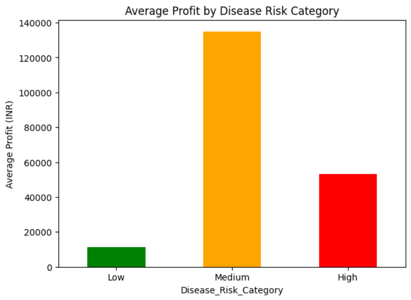
No — the relationship is non-linear. Medium-risk farms show the *highest* average profit, while Low-risk farms show the lowest, suggesting other factors interact with disease risk.

---

## 💡 Key Insights

1. Outliers represent genuine high-performing farms, not data errors
2. Yield distribution is heavily right-skewed
3. High-yield farms cluster around an optimal 600–700mm rainfall zone
4. Kharif season delivers the highest and most consistent yield
5. Drip/Sprinkler irrigation outperforms Flood/Rainfed irrigation
6. Farm area strongly drives cost; individual inputs show weak correlation with yield
7. Higher rainfall is linked to higher disease/pest risk
8. **Zaid season operates at an average loss** — the least resource-efficient season
9. Punjab, Maharashtra, and Karnataka are the most profitable states; no state operates at a loss
10. Sugarcane is far more water-efficient than any other crop
11. Disease risk and profit have a non-linear relationship

## ✅ Recommendations

- Review farming practices in the Zaid season to address the observed losses
- Promote Drip and Sprinkler irrigation over Flood/Rainfed methods
- Strengthen pest-control measures in Kharif season to protect its high profitability
- Encourage water-efficient crops like Sugarcane in water-scarce regions
- Focus on balanced, combined input strategies rather than increasing any single input

## ⚠️ Limitations

- Zaid season has a much smaller sample size (~600 vs ~1,650–1,800), reducing reliability
- The non-linear disease risk–profit relationship could not be fully explained with available data
- Analysis is correlation-based, not causal
- Outliers were retained, which may slightly skew some average-based comparisons

## 📝 Conclusion

Agricultural performance varies significantly across seasons, irrigation methods, and regions. Kharif season is the most profitable and consistent, while Zaid season is resource-inefficient and loss-making on average. Drip/Sprinkler irrigation and balanced input strategies support better yield outcomes, and Sugarcane stands out for water efficiency. These findings can support evidence-based seasonal planning and resource allocation decisions, with further investigation recommended around Zaid season losses and the disease-risk–profit relationship.

---

*Submitted as part of the VOIS for Tech Data Analytics Virtual Internship, in collaboration with Edunet Foundation.*
